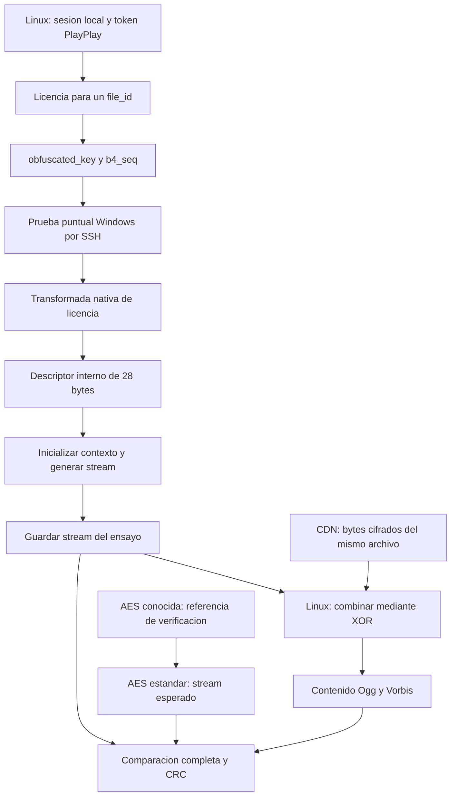

# Cómo funciona la prueba y qué significa extraer la AES

Estado: 2026-09-24, después del [ensayo token148/v5](TOKEN148_ONESHOT_2026-09-24.md).
Las propuestas de este documento no se ejecutaron al redactarlo.

## Explicación para empezar

Tenemos una caja que sabe descifrar correctamente, pero todavía no sabemos
obtener la clave que usa. Esa caja es parte del código de Spotify Windows
1.2.92.148, ejecutado mediante Frida en una prueba puntual por SSH. No se
necesita servidor HTTP ni servicio LAN para esta prueba.

| Objeto | Qué es | Estado |
|---|---|---|
| Credenciales de cuenta | Autorizan las peticiones de la sesión | Se usan en Linux; no se copian al script Windows |
| Token PlayPlay | Constante que acompaña la solicitud de licencia y se relaciona con una implementación del cliente | Token148 `02d29f82a8396930aab0a5885c81da7a`, protocolo5 |
| `file_id` | Identifica el archivo concreto, no solo el título de la canción | Une licencia y bytes del CDN |
| `obfuscated_key` | Valor de 16 bytes de la licencia que el cliente debe transformar | Entrada que procesamos en Windows |
| `b4_seq` | Auxiliar de cuatro bytes de la licencia | Conservado; sustituirlo por cero no altera los dos casos ensayados |
| AES de contenido | Clave utilizable por AES estándar | 16 bytes en los dos recursos comprobados; aún no la extraemos |
| Stream de descifrado | Secuencia generada a partir de la clave y la posición | Windows genera correctamente 4096 bytes por recurso |

Token, clave ofuscada y AES pueden medir 16 bytes sin ser intercambiables. El
token PlayPlay tampoco es el bearer ni el Client-Token que autentican peticiones.

## Recorrido de los datos

En CTR, AES transforma sucesivos contadores en bloques de stream. El contenido
se recupera combinando el stream y el archivo cifrado mediante XOR. Podemos
obtener contenido correcto aunque la caja no entregue la clave. Es la
construcción descrita por [NIST SP800-38A, sección6.5](https://nvlpubs.nist.gov/nistpubs/Legacy/SP/nistspecialpublication800-38a.pdf).

La ruta observada pasa por `0x4a0268` → transformada VM → descriptor28 →
`0xd9e2e4` → generador `0xd9d0f0`. Son RVAs del build/hash comprobado, no
direcciones portables. El candidato de `0x49f854` no coincide con la AES.

## Qué demostramos y qué falta

Elegimos dos archivos cuyas AES ya estaban publicadas en los fixtures. Para
cada uno obtuvimos licencia nueva y 4096 bytes del CDN. El generador coincide
con AES-128-CTR y produce contenido con CRC Ogg/Vorbis correcto, en dos
ejecuciones y dos variantes b4_seq por recurso.

Conocíamos las respuestas de esos dos ejercicios: comprobamos que la caja
trabaja bien, pero aún no sabemos obtener la clave de un archivo nuevo. Tampoco
probamos reproducción completa, ESP32 o arranque frío.

Extraer AES16 significa crear un procedimiento que reciba la licencia y el
contexto necesario y devuelva esos 16 bytes **sin proporcionarle la respuesta
conocida**. cspot podría entonces descifrar el archivo con su propio AES.
Una ayuda puntual Windows para obtener la clave podría sustituir la generación
continua de stream. Eliminar Windows también exigiría portar o emular la
transformación; todavía no está demostrado.

La clave puede estar repartida, transformada o incorporada a tablas. No tiene
por qué existir como 16 bytes contiguos fáciles de copiar. Obtener stream
correcto tampoco proporciona, por sí solo, una forma práctica de invertir AES
y recuperar la clave desde su salida.

## Factibilidad y estimación

**Es técnicamente factible como objetivo de investigación; no está resuelto.**
Mi estimación de trabajo es **60–80% de conseguir un extractor AES16 para este
build Windows tras unas pocas sesiones de investigación dirigida**, manteniendo
el acceso al entorno y los controles. Es juicio subjetivo, no frecuencia medida,
garantía ni conclusión de las fuentes citadas. No estima el siguiente intento
ni la posibilidad de portarlo a ESP32. Revisarla tras las primeras capturas limpias.

A favor: ejecución nativa controlada, dos referencias, contenido comprobado,
ruta acotada y repeticiones sin otra canción. En contra: representación interna
desconocida, candidato equivocado, descriptor variable y posibilidad de que
ninguna clave de ronda estándar aparezca en claro. Una clave de ronda auténtica
elevaría la confianza; codificaciones variables difíciles de relacionar la reducirían.

## Evitar encontrar nuestras propias claves

Los ensayos actuales inyectan `diagnosticData.aes`; además el runner agrega
`vectors` con claves conocidas al JS. **Las referencias ya entraron en el proceso
instrumentado.** Una búsqueda global podría encontrar nuestras copias, no datos
producidos por Spotify. Descargar el script no garantiza borrar sus restos.

Esto no invalida el control del generador: la llamada nativa recibe entrada
ofuscada y auxiliar; las AES se usan para comparar, no como argumentos de esa
llamada. Pero una búsqueda de claves necesita un capturador distinto:

- No cargar AES, claves de ronda ni respuestas esperadas en Windows. El runner
  actual no sirve para esa separación sin modificar la inyección de `vectors`.
- Calcular y comparar las referencias fuera del proceso instrumentado.
- Para búsquedas generales, preferir un proceso recién inicializado que nunca
  recibiera esas referencias, coordinando el reinicio y repitiendo el control.
- Identificar qué instrucción del cliente produce y consume cada coincidencia.
  Encontrar el mismo valor en cualquier lugar no demuestra extracción.

## Experimentos propuestos, en orden

### 1. Buscar huellas de la clave

Capturar registros y buffers de la ruta entre `0x49f854`, el descriptor y
`0xd9e2e4`. Comparar offline con las claves conocidas, sus órdenes de bytes y
las claves de ronda derivadas. AES define la expansión en
[FIPS197, sección5.2](https://nvlpubs.nist.gov/nistpubs/FIPS/NIST.FIPS.197-upd1.pdf).

Idea útil: puede haberse borrado la clave original pero quedar una clave de
ronda. En AES-128, una clave de ronda completa, estándar y con índice conocido
permite reconstruir la principal invirtiendo las recurrencias de expansión.
Es una deducción de esas recurrencias; no prueba que aquí exista una en claro.
Exigir coherencia de varias rondas y validación por contenido.

Resultado buscado: representación auténtica y extracción repetible sobre otro
recurso, sin suministrar su AES al capturador.

### 2. Comparar repeticiones y licencias diferentes

El descriptor cambia para una misma licencia aunque el stream no cambie.
Capturar su construcción e inicialización para separar aleatoriedad, punteros,
estado y dependencias de clave. Comparar también ambos recursos.

Idea útil: dos partes variables podrían combinarse para dar un valor estable,
por ejemplo mediante XOR. No eliminar datos por ser variables ni inventar
fórmulas con dos ejemplos. La relación candidata debe corresponder a operaciones
reales y acertar en un recurso reservado para validación.

Resultado buscado: localizar dónde se combina o elimina una protección y
dirigir el siguiente hook a ese punto.

### 3. Seguir hacia atrás el cálculo del bloque correcto

Para las referencias podemos calcular los estados intermedios de AES estándar.
Trazar un bloque nativo y buscar correspondencias en los registros y tablas de
sus últimos pasos, permitiendo diferencias de representación.

Idea útil: el final del generador puede ser más reconocible que toda la VM de
licencia. Analizar solo las dependencias de la salida reduce el ruido. Es seguir
el cálculo interno, no invertir el cifrado desde su salida pública.

Resultado buscado: correspondencia verificable con una operación o clave de
ronda AES que permita reconstruir la clave principal.

### 4. Análisis estadístico de trazas si lo anterior no alcanza

Observar accesos a memoria y valores en muchas operaciones con **la misma clave**
y buscar dependencias con estados AES previstos. Differential Computation Analysis
recuperó claves en implementaciones white-box estudiadas por
[Bos y colaboradores](https://eprint.iacr.org/2015/753). Esto demuestra que la
técnica existe, no que funcionará en este cliente.

CTR ofrece contadores y salidas relacionadas. Antes hay que comprobar diversidad:
256 contadores consecutivos no varían todos sus bytes. Rondas finales o una
selección más amplia de posiciones podrían ayudar. Cambiar licencias y claves
no sustituye una colección de trazas bajo una misma clave.

Resultado buscado: señal reproducible con referencia conocida, seguida de
recuperación en un caso ciego. Es una escalada de costo, no el primer intento.

## Criterio de éxito y recomendación

El extractor recibe una licencia sin AES conocida, devuelve 16 bytes y permite
descifrar el archivo correspondiente con AES estándar. Comprobar ambos recursos
actuales y después otro reservado, sin usar su respuesta para ajustar el método.
Registrar build/hash, repeticiones, posición de contenido, CRC y estructura.
Probar arranque nuevo por separado. Una tabla hardcodeada, la referencia del
test o un descriptor dependiente del proceso no cierran el objetivo AES16.

Empezar por captura limpia y experimentos1–2. Según sus resultados, seguir con
trazado hacia atrás o análisis estadístico. Ninguno requiere servicio LAN.
