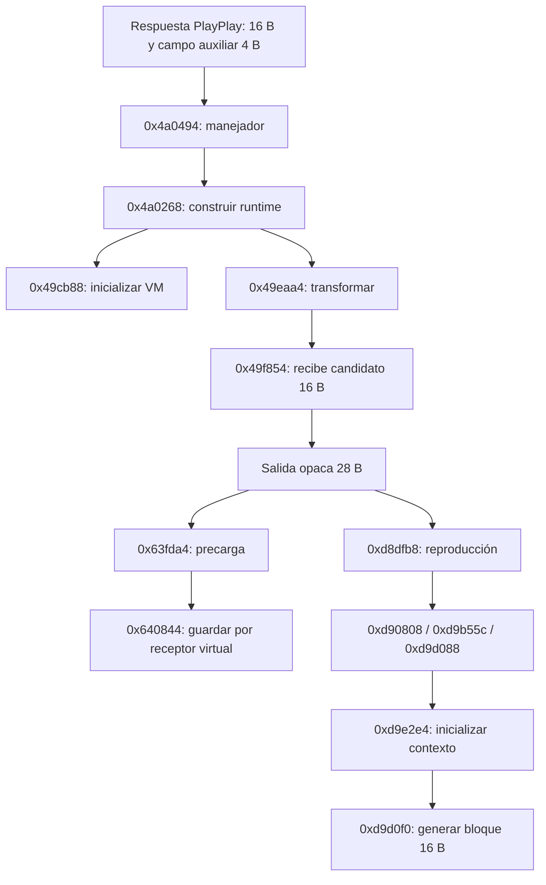

# VM y ruta de audio observadas en Spotify 1.2.92.148

Documento técnico consolidado de la sesión **2026-09-24**. Los nombres asignados
son descriptivos, no símbolos oficiales. RVAs relativos al módulo; hashes en
[FACTS.md](FACTS.md). No extrapolar este layout a 483/485/667 por número de versión.

## Qué se transforma

**Actualización posterior:** el [control token148/v5](TOKEN148_ONESHOT_2026-09-24.md)
conecta ahora el generador con AES-128-CTR: 4096 bytes idénticos por recurso,
dos recursos, dos variantes b4_seq, dos ejecuciones. El contenido CDN descifra
con CRC Ogg/Vorbis válido. Las frases inferiores que mantienen abierto ese
enlace corresponden a los ensayos anteriores con token E. Sigue abierta la
representación interna y la extracción AES16; el candidato no coincide.

Separar cuatro objetos:

1. **Token PlayPlay**: constante del request; token148 en cspot, E en los ensayos anteriores. No es el bearer de cuenta.
2. **`obfuscated_key`**: 16 bytes devueltos por la licencia; entran al VM.
3. **Candidato interno**: 16 bytes en RDX al entrar a `0x49f854`. Es repetible;
   llamarlo «plaintext AES» no está justificado por nuestros controles.
4. **Salida de VM**: estructura opaca de **28 bytes**. Se denomina «envoltorio»
   por su uso posterior y variabilidad, sin afirmar haber revertido su formato.

Las ramas/calls están respaldadas por captura y desensamblado según la tabla de
FACTS. No se trazó dinámicamente cada instrucción de la cadena. El control posterior token148 vincula el bloque nativo con AES-128-CTR durante
4096 bytes por recurso. Sigue pendiente extraer la clave de esa representación.

## Ejecutar el VM con snapshot

Contrato usado: `VmObjectTransform(vm, input16, output, init16)` con cuatro
punteros x64. En la entrada natural se copian los 144 bytes del objeto y los
16 del inicializador. El valor observado del inicializador es
`a33c929c31c3e0eefeedebdaa1e7ff7f`; no confundirlo con IV de audio.

El objeto VM se muta: la historia registró un crash al reutilizarlo. Los ensayos
actuales restauran una copia por llamada, incluidos los bytes del inicializador.
Un snapshot superficial puede contener referencias internas; **no se probó su
validez después de reiniciar Spotify** ni la vida indefinida de esos punteros.
El servidor antiguo guarda `args[3]` como puntero; las pruebas nuevas que usan
snapshot copian su contenido para evitar depender de esa vida útil.

Frida por defecto intercepta excepciones nativas (`steal`); en este VM produjo
`Error: system error`. `exceptions: 'propagate'` permitió al proceso manejarlas.
Para observar hooks internos de llamadas NativeFunction se usó `traps: 'all'`.
Las repeticiones se difieren con `setImmediate` después del retorno natural;
se evita la reentrada dentro del `onEnter` original. Se filtra por hilo y etiqueta
para no mezclar actividad de reproducción concurrente.

El intento original desde `onEnter` mostró cero copias en replays aunque sí había
copias naturales. El trazado corregido las observa. No confundir una supresión
de instrumentación con una transformada vacía.

## Ejecutar el VM con runtime nuevo

El desensamblado de `0x4a0268` muestra construcción del entorno, llamada a
`0x49cb88` en `0x4a0407` y a `0x49eaa4` en `0x4a041d`. La salida vive en su stack;
al terminar, puede enviarla a un callback de la solicitud.

`check_key_pipeline_148.js` reproduce esa ruta con:

- Primer argumento: 256 bytes locales inicializados a cero; byte `+0x70 = 1`.
  El código comprueba ese byte antes de leer/invocar el callback (`self+0x10`).
  No es un objeto de solicitud persistente del cliente ni se inserta en una cola.
- Segundo: entrada de 16 bytes.
- Tercero: campo auxiliar local de 4 bytes, inicializado a cero. No afirmar que
  sea el mismo auxiliar de salida de `0xd9e2e4` solo por compartir tamaño.
- Cuarto: nulo, selecciona la rama de entorno por defecto observada estáticamente.
- Hook al retorno de `0x49eaa4`: copiar los 28 bytes antes de que termine su caller.
- Hook en `0x49f854`: exigir que el candidato coincida con el fixture anterior.

Dos entradas naturales y once vectores pasan ese control, dos veces cada uno.
Esto elimina **la espera de una nueva canción para estos ensayos**. Sigue
requiriendo Spotify 148 inicializado: no es `LoadLibrary` standalone, no se probó
arranque frío, proceso sin sesión ni otro build.

## Candidato y salida de 28 bytes

La firma de la rutina de copia dio una única coincidencia: `0x17780e0`.
En `0x49f904` se copian 16 bytes desde el argumento candidato; el retorno es
`0x49f909`. La copia final en `0x49f961` tiene longitud `0x1c` (28).

Los primeros 24 bytes del resultado varían entre llamadas equivalentes. En las
capturas completas los últimos cuatro son `01000000`; su significado no está
identificado (no llamarlo versión, flag o checksum como hecho). Los scripts
iniciales guardaban solo 24 y el servidor devolvía los primeros 16 como `aes_key`.
Esa selección no supera el control de repetibilidad.

El candidato previo sí coincide entre ejecución natural y replay. Los 11 casos
E repetidos dan el mismo candidato, **pero ninguno coincide con su AES publicada**.
La función posterior `0x49f854` todavía realiza trabajo: no se ha demostrado que
el candidato sea el último valor en claro antes de una protección de AES.

## Licencia, recurso y callbacks

El layout inspirado en SpotiLoad leyó valores coherentes en 148:

| Dato leído | Dirección dentro de la entrada al manejador |
|---|---|
| Recurso 20 B | `args[1] + 0x8c` |
| Tipo de recurso | `args[1] + 0xa0`, valor observado 0 |
| Callback | puntero en `args[1] + 0x28` |
| Respuesta | `std::string` en `args[2]`: tamaño +16, capacidad +24, inline si <=15 |

Los scripts limitan respuesta a 256 bytes y no leen headers HTTP. Capturaron
campo protobuf 1 de 16 bytes y campo 2 (`b4_seq`) de 4. El primero coincide con
la entrada VM. El significado del campo 2 queda pendiente; los callbacks
observados no consumen R8 antes de reutilizarlo, pero eso no prueba que otras
rutas lo ignoren. Esas capturas históricas no incluían el request. La nota externa posterior
aporta token148/v5, validado después por contenido; ver [STATUS](../STATUS.md).

Precarga: `0x63fda4 → 0x640844`, con log estático «Prefetch: Could not save key,
backing off for 1 minute». El receptor se busca en `[self+0xc0]`, slot de vtable
`+0x10`. El hook preparado para ese receptor no produjo una captura confirmada:
la siguiente licencia tomó el callback de reproducción. Sigue siendo una línea
abierta, no una prueba de que ese receptor entregue una AES.

Reproducción: `0xd8dfb8 → 0xd90808 → 0xd9b55c → 0xd9ce94 → 0xd9d088`.
`0xd9ce94` es un salto, por lo que puede no tener una entrada propia en `.pdata`.
Distinguir estos recursos del track audible y de los objetos presentes en caché:
una precarga puede solicitar contenido que todavía no se reproduce.

## Contexto y generador de bloques

Contratos ensayados con `NativeFunction`, `exceptions: propagate`, `traps: all`:

| Función | Argumentos usados | Resultado observado |
|---|---|---|
| `0xd9e2e4` | contexto local, descriptor 28 B, puntero auxiliar 4 B | Llena contexto y auxiliar |
| `0xd9d0f0` | contexto, salida reservada 32 B | Escribe bloque 16 B y muta contexto |

Los harness reservan 4096 bytes para el contexto, cero antes de inicializar.
**4096 no es el tamaño real deducido de la estructura**. El snapshot natural
copia `0x2e4` (740) bytes; el desensamblado muestra tablas y acceso al contador
codificado alrededor de `+0x2e0`. No se extrajo un key schedule AES estándar.

Con 13 entradas y dos runtimes frescos por entrada, se obtienen cuatro bloques
idénticos por par y auxiliares iguales, pese a envoltorios distintos. Con el
snapshot de un bloque real de reproducción, el primer replay dio exactamente
`b323946840ed95fc36fe2019d8d45887`, igual al natural. Este último contexto no se
asoció a un `file_id` concreto; **no mezclarlo** con una de las licencias previas
como si esa correspondencia estuviera comprobada.

## Hipótesis de la etapa token E y límites de sus negativos

El siguiente experimento vigente está en [PLAN](../PLAN.md). La tabla siguiente
conserva hipótesis de los ensayos E: token148 ya tiene control de contenido positivo.

| Hipótesis | Motivo / límite | Prueba útil siguiente |
|---|---|---|
| Candidato previo es intermedio, no AES | Estable pero no coincide con fixtures ni bloques AES calculados | Seguir transformaciones entre `0x49f854`, descriptor e inicializador |
| Estado inicial nativo no equivale al IV estándar | AES(key, IV estándar) no coincide; contador codificado aún desconocido | Asociar posición de audio y contador al contexto capturado |
| Token/version o contrato adicional diferente | E ofrece cuatro entradas por recurso; Windows request desconocido | Control AES independiente + captura del request/campo auxiliar si hace falta |
| Representación/orden de bytes del contexto difiere | Rutina usa tablas, no una estructura AES estándar reconocida | Demostrar una relación algebraica o extraer un punto en claro |
| Binario 148 no compatible con E | Posible, pero los negativos todavía no tienen extracción AES positiva | Probar con una entrada cuya AES esté confirmada independientemente |

Se descifraron cuatro bloques generados con AES-ECB inversa, tanto con candidatos
como con AES conocidas, buscando incrementos de contador big-endian. No aparecieron.
Esa comprobación acota una representación concreta; no prueba que el generador no
sea CTR ni que los bytes de salida ya estén en la representación esperada.
La [evidencia](VALIDATION_148_2026-09-24.md) incluye receta para repetirlo offline.

No hay una réplica matemática C++ ni un algoritmo white-box revertido. Usar
«VM ejecutable» y «generador repetible» con esos alcances, no «AES resuelta».
